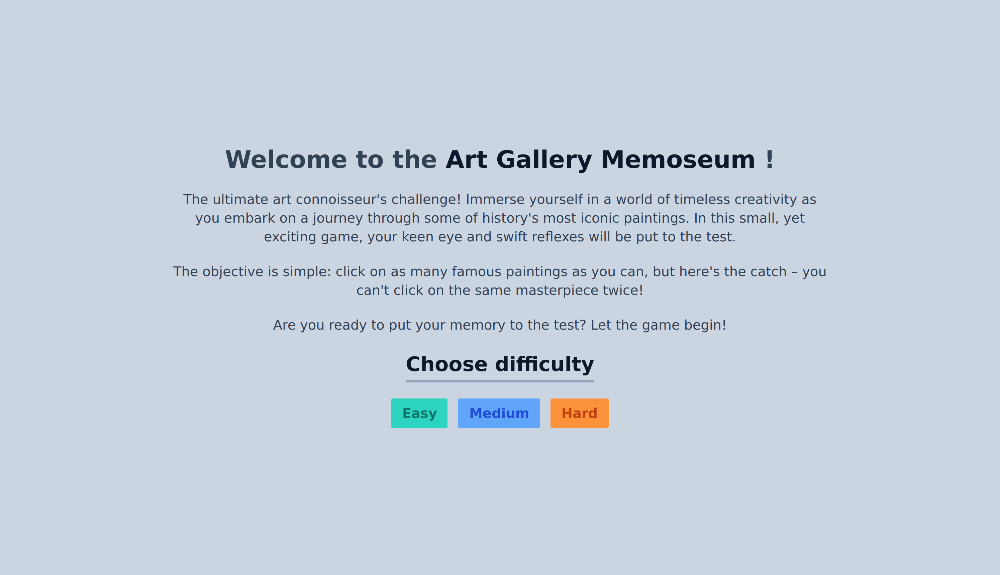
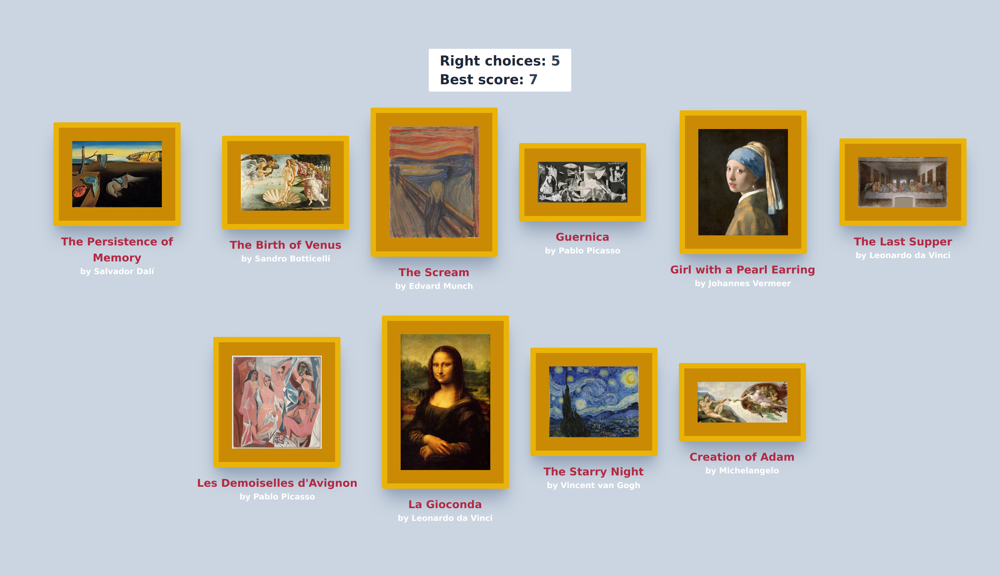

<h1 align="center" id="title">ART GALLERY Memoseum</h1>

This project was part of The Odin Project's JavaScript curriculum. The main goal of this project was to build a memory card game using React (especially hooks and lifecycle methods). The game consists of six levels of difficulty, in each of which, the user must click on all images exactly once. When the user clicks on an image, the cards are all randomly redistributed. If the user clicks on the same image twice, the game ends. The user can then restart the game, with their best result being saved.

<h2>🚀 Live Demo</h2>

[https://isinavarro-odin-memory-app.netlify.app/](https://isinavarro-odin-memory-app.netlify.app/)

<h2>Project Screenshots:</h2>

<h2>💻 Built with</h2>

Technologies used in the project:

- React JS
- TailwindCSS
